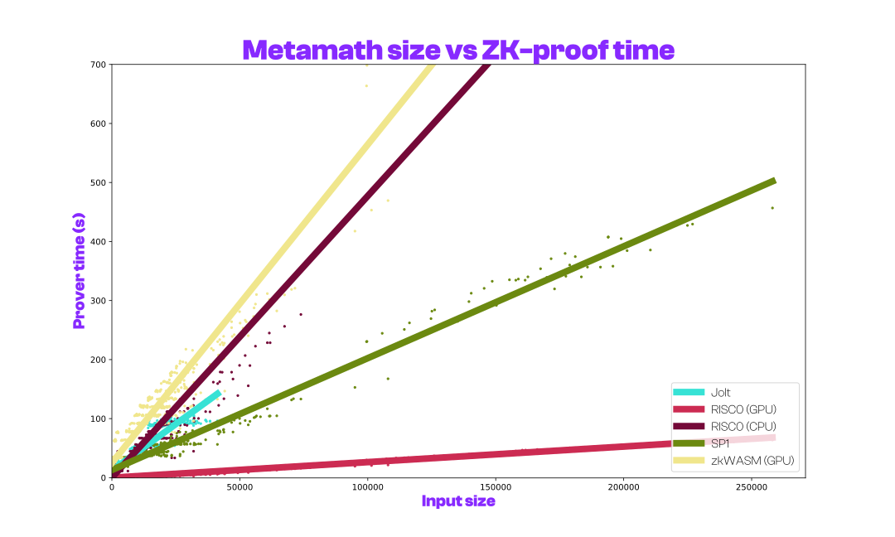

# Benchmarking of $\pi^2$ ZK Metamath checkers

This file contains information on the measurements that we have taken when running our [Metamath](https://us.metamath.org/) (MM) proof checker
on different Metamath files in various zero-knowledge Virtual Machines (zkVMs).

- [Benchmarking of $\pi^2$ ZK Metamath checkers](#benchmarking-of-pi2-zk-metamath-checkers)
- [Our experiment](#our-experiment)
- [How to run our tests](#how-to-run-our-tests)
  - [Docker set up](#docker-set-up)
  - [Instructions](#instructions)
    - [Examples](#examples)
      - [1. Running all MM files with all zkVMs](#1-running-all-mm-files-with-all-zkvms)
      - [2. Running a single MM file with all zkVMs](#2-running-a-single-mm-file-with-all-zkvms)
      - [3. Running a single zkVM](#3-running-a-single-zkvm)
- [Our results](#our-results)
  - [Proof file size VS CPU proof time](#proof-file-size-vs-cpu-proof-time)
  - [ZK Backends](#zk-backends)
    - [Cairo](#cairo)
    - [Jolt](#jolt)
    - [Lurk](#lurk)
    - [RISC0 (GPU)](#risc0-gpu)
    - [RISC0 (CPU)](#risc0-cpu)
    - [SP1](#sp1)
    - [zkWASM (GPU)](#zkwasm-gpu)
- [Disclaimers](#disclaimers)
- [One possible optimization](#one-possible-optimization)


# Our experiment

We run our experiment on a large set of Metamath files with various input sizes, where the input size of a Metamath file is the number of its containing symbols (tokens).

The list of zkVMs that we have considered is the following one:
- [Cairo](https://docs.cairo-lang.org/)
- [Jolt](https://github.com/a16z/jolt)
- [Lurk](https://github.com/argumentcomputer/lurk-beta)
- [Nexus](https://github.com/nexus-xyz/nexus-zkvm)
- [Risc0](https://github.com/risc0/risc0)
- [SP1](https://github.com/succinctlabs/sp1)
- [zkWASM](https://github.com/DelphinusLab/zkWasm)

The implementations of our Metamath proof checker in each of the above zkVMs can be found in the [checker/mm](https://github.com/Pi-Squared-Inc/pi2/tree/main/checker/mm) folder in the main pi2 repo. They each consist of a guest program which runs on the specific virtual machine and a host program which is our interface to actually running the guest, providing input for it and processing its output. The Metamath files that we are testing can be found in the mm-files folder.

## GPU support

Out zkVMs that we are considering only Risc0, zkWASM, SP1 and Cairo provide GPU support. Still, we were only able to run Risc0 and zkWASM with GPU support due to internal setup issues for SP1 and evelvind code base for Cairo.

## Rust support

5 out of the 7 tested zkVMs (Risc0, zkWASM, Jolt, SP1, Nexus) provide a Rust compiler. Therefore, for them we have been
able to develop and use a shared library for checking Metamath proofs, and thus the comparison among these 5 should be
considered more precise, as they share most of the code. While in Cairo and Lurk we implemented the same program
(a metamath checker), they were implemented independently of the rust code base and independent of each-other, so the
comparison betwen them and the the other 5 should be taken with a grain of salt.

## Versions of the zkVMs used

- Cairo:  the Lambdaworks prover, main branch, commit [a591186](https://github.com/lambdaclass/lambdaworks/commit/a591186e6c4dd53301b03b4ddd69369abe99f960)
  (the current version, while faster, does not yet support Cairo)
- Jolt: `main` branch, commit [3b14242](https://github.com/a16z/jolt/commit/3b142426d9648299d9c6912e7e1b4698cf91491b)
- Lurk: `main` branch, commit [57c48b9](https://github.com/argumentcomputer/lurk/commit/57c48b987a94ba1f9752408a0990882c9f4f506b)
- Nexus: tag [v0.2.3](https://github.com/nexus-xyz/nexus-zkvm/releases/tag/v0.2.3)
- Risc0: version 1.0.5
- SP1: `dev` branch, commit [2c78683](https://github.com/succinctlabs/sp1/commit/2c7868364cb832531e8cafd258aa06fbab079459)
- zkWASM: `main` branch, commit [f5acf8c](https://github.com/DelphinusLab/zkWasm/commit/f5acf8c58c32ac8c6426298be69958a6bea2b89a)

## Certificate sizes

For each of the zkVMs we've been using the default type of certificate offered by that particular zkVM.
For example, the default means composite certificates for Risc0 and SP1 and succinct certificates for zkWASM.
We've experimented with generating _succinct_ certificates for Risc0 and _compressed_ certificates for SP1;
the elapsed times to generate the shorter certificates seemed to be ~1.6 times larger than that for composite certificates.

# How to run our tests

Our full benchmark suite consists of 1225 Metamath files, split in two classes:
* A class generated from standard Metamath databases [(1)](https://github.com/metamath/set.mm/blob/develop/demo0.mm), [(2)](https://github.com/metamath/set.mm/blob/develop/hol.mm) by dividing them into small lemmas. These tests can be found under `checker/mm/common/metamath-files/benchmark_mm/small` in the Docker image;
* A class of $\pi^2$ *proofs of execution* of various lengths, which prove the correctness of an ERC20-like program written in IMP. These tests can be found under `checker/mm/common/metamath-files/benchmark_mm/imp`.
  * If you want to find more on how we generate mathematical proofs of program executions, check out our [proof generation demos](https://github.com/Pi-Squared-Inc/devcon-2024/tree/main/demos#generating-metamath-proofs-for-arbitrary-programs) and our [documentation](https://docs.pi2.network/).

Even though we have set up the Docker image for you to run the tests, we have provided the execution code in the [checkers](checkers/) directory.

## Docker set up

We provide all our checkers and benchmarks in a publicly available Docker image. Before you begin, make sure you have a working installation of Docker, following the instructions [here](https://docs.docker.com/engine/install/ubuntu/#install-using-the-repository).

Once done, please run the following command to pull the $\pi^2$ ZK Metamath checkers Docker image:
```bash
docker pull ghcr.io/pi-squared-inc/pi2-zk-mm-checkers:latest
```

## Instructions

To run our benchmarks, first attach to a shell in our Docker container:
```bash
docker run -it ghcr.io/pi-squared-inc/pi2-zk-mm-checkers bash
```

As a sanity check, you can run the following command, which will return all ZK backends available in the container:
```bash
$ poetry run check-proof -a
Available backends: ['cairo', 'jolt', 'risc0', 'sp1', 'nexus', 'lurk']
```

The basic syntax for invoking the benchmarking program is:
```bash
poetry run check-proof <zkVM> <path to MM proof/s> [--zk-csv PATH] [--log PATH] -v
```
* Setting the `zkVM` argument to `all` will invoke all checkers on the Metamath files provided. Otherwise, it should be one of `cairo`, `jolt`, `risc0`, `sp1`, `nexus` or `lurk`.
* The optional `--zk-csv` parameter will output a benchmarking report to CSV.
* The optional `--log` paramter will save the output of the zkVMs to file.

**Notes:**
  1. The Docker image does not provide GPU-accelerated builds for any of the zkVMs.
  2. The checkers are timed-out at 15 minutes per Metamath file.

### Examples
#### 1. Running all MM files with all zkVMs
The following command will run **the full benchmark suite** on **all zkVMs**, generate a report in `report.csv`, and save the zkVM logs to `zkvms.log`:
```bash
poetry run check-proof all ../mm/common/metamath-files/benchmark_mm --zk-csv report.csv --log zkvms.log -v
```
For a lighter measurement, you can also point the program to the directory containing our small benchmarks:
```bash
poetry run check-proof all ../mm/common/metamath-files/benchmark_mm/small --zk-csv report.csv --log zkvms.log -v
```
#### 2. Running a single MM file with all zkVMs
You can also provide the path of a single Metamath database:
```bash
poetry run check-proof all ../mm/common/metamath-files/benchmark_mm/small/hol/hol_idi.mm --zk-csv report.csv --log zkvms.log -v
```

#### 3. Running a single zkVM
By replacing the `all` keyword with the name of a zkVM, you can execute our checker only in the requested VM:
```bash
poetry run check-proof <cairo | jolt | risc0 | sp1 | nexus | lurk | wasm> ...
```

# Our results

To have a more fair comparison among different Metamath files, we pre-tokenize the input
and count the number of resulting tokens as the `Input size` in the columns below.

## Proof file size VS CPU proof time



__Note__: Nexus is not pictured in the graph above because even on our smallest input execution was quite slow (512 seconds).

## ZK Backends

We selected eight representative files and choose to present their corresponding statistics.

Measurements taken on a **AMD EPYC 9354 32-Core CPU (64 threads)**, with **4x NVIDIA GeForce RTX 4090 24GB GPU's** and **248GB RAM**.

All times below are measured in seconds. Where "**TO / OOM**" is indicated, it means the checker was either timed out (after 900 seconds), or it exceeded system memory limits.

### Cairo
| Benchmark                                                                         |   Input size |   Proving time |   Verification time |
|:----------------------------------------------------------------------------------|-------------:|---------------:|--------------------:|
| [hol_idi.mm](mm-files/hol_idi.mm)                                                 |           39 |          0.913 |               0.029 |
| [hol_wov.mm](mm-files/hol_wov.mm)                                                 |          147 |          5.975 |               0.229 |
| [hol_ax13.mm](mm-files/hol_ax13.mm)                                               |          508 |         25.623 |               0.993 |
| [hol_cbvf.mm](mm-files/hol_cbvf.mm)                                               |         1786 |        110.230 |               4.321 |
| [45.erc20transfer_success_tm_0_6.mm](mm-files/45.erc20transfer_success_tm_0_6.mm) |         6249 |        228.487 |               9.102 |
| [25.erc20transfer_success_tm_0_9.mm](mm-files/25.erc20transfer_success_tm_0_9.mm) |        21332 |        **TO / OOM**     |             **TO / OOM**     |
| [3.erc20transfer_success_tm_0.mm](mm-files/3.erc20transfer_success_tm_0.mm)       |        73862 |        **TO / OOM**     |             **TO / OOM**     |
| [9.erc20transfer_success.mm](mm-files/9.erc20transfer_success.mm)                 |       258135 |        **TO / OOM**     |             **TO / OOM**     |

### Nexus

For the smallest file, hol_idi.mm, which consists of 18 lines of Metamath declarations and proofs (39 tokens), Nexus proving time is 512 seconds, hence
we did not generate a table for Nexus.


### Jolt
| Benchmark                                                                         |   Input size |   Proving time |   Verification time |
|:----------------------------------------------------------------------------------|-------------:|---------------:|--------------------:|
| [hol_idi.mm](mm-files/hol_idi.mm)                                                 |           39 |          3.170 |               0.174 |
| [hol_wov.mm](mm-files/hol_wov.mm)                                                 |          147 |          5.350 |               0.156 |
| [hol_ax13.mm](mm-files/hol_ax13.mm)                                               |          508 |         10.290 |               0.229 |
| [hol_cbvf.mm](mm-files/hol_cbvf.mm)                                               |         1786 |         28.530 |               0.194 |
| [45.erc20transfer_success_tm_0_6.mm](mm-files/45.erc20transfer_success_tm_0_6.mm) |         6249 |         30.000 |               0.200 |
| [25.erc20transfer_success_tm_0_9.mm](mm-files/25.erc20transfer_success_tm_0_9.mm) |        21332 |         91.870 |               0.218 |
| [3.erc20transfer_success_tm_0.mm](mm-files/3.erc20transfer_success_tm_0.mm)       |        73862 |        **TO / OOM**     |             **TO / OOM**     |
| [9.erc20transfer_success.mm](mm-files/9.erc20transfer_success.mm)                 |       258135 |        **TO / OOM**     |             **TO / OOM**     |

### Lurk
| Benchmark                           |   Input size |   Proving time |
|:------------------------------------|-------------:|---------------:|
| [hol_idi.mm](mm-files/hol_idi.mm)   |           39 |          0.924 |
| [hol_wov.mm](mm-files/hol_wov.mm)   |          147 |          5.588 |
| [hol_ax13.mm](mm-files/hol_ax13.mm) |          508 |         18.167 |
| [hol_cbvf.mm](mm-files/hol_cbvf.mm) |         1786 |        195.757 |

We have encountered out-of-memory issues with the next largest Metamath file in our benchmarking suite. However, memory consumption seems to not be monotonic in Metamath input size, as is the general trend with the other checkers. Thus, we do not include the other benchmarks in the table for Lurk.

See [this thread](https://zulip.argument.xyz/#narrow/stream/17-lurk/topic/Lurks.20gets.20killed.20for.20memory.20exhaustion) on Argument Zulip for further discussion.

### RISC0 (GPU)
| Benchmark                                                                         |   Input size |   Proving time |   Verification time |
|:----------------------------------------------------------------------------------|-------------:|---------------:|--------------------:|
| [hol_idi.mm](mm-files/hol_idi.mm)                                                 |           39 |          0.443 |               0.016 |
| [hol_wov.mm](mm-files/hol_wov.mm)                                                 |          147 |          0.553 |               0.017 |
| [hol_ax13.mm](mm-files/hol_ax13.mm)                                               |          508 |          0.769 |               0.018 |
| [hol_cbvf.mm](mm-files/hol_cbvf.mm)                                               |         1786 |          2.070 |               0.035 |
| [45.erc20transfer_success_tm_0_6.mm](mm-files/45.erc20transfer_success_tm_0_6.mm) |         6249 |          2.090 |               0.035 |
| [25.erc20transfer_success_tm_0_9.mm](mm-files/25.erc20transfer_success_tm_0_9.mm) |        21332 |          3.950 |               0.053 |
| [3.erc20transfer_success_tm_0.mm](mm-files/3.erc20transfer_success_tm_0.mm)       |        73862 |         15.990 |               0.225 |
| [9.erc20transfer_success.mm](mm-files/9.erc20transfer_success.mm)                 |       258135 |         63.740 |               0.885 |

### RISC0 (CPU)
| Benchmark                                                                         |   Input size |   Proving time |   Verification time |
|:----------------------------------------------------------------------------------|-------------:|---------------:|--------------------:|
| [hol_idi.mm](mm-files/hol_idi.mm)                                                 |           39 |          3.140 |               0.016 |
| [hol_wov.mm](mm-files/hol_wov.mm)                                                 |          147 |          5.770 |               0.017 |
| [hol_ax13.mm](mm-files/hol_ax13.mm)                                               |          508 |         11.220 |               0.018 |
| [hol_cbvf.mm](mm-files/hol_cbvf.mm)                                               |         1786 |         33.900 |               0.035 |
| [45.erc20transfer_success_tm_0_6.mm](mm-files/45.erc20transfer_success_tm_0_6.mm) |         6249 |         33.480 |               0.035 |
| [25.erc20transfer_success_tm_0_9.mm](mm-files/25.erc20transfer_success_tm_0_9.mm) |        21332 |         66.280 |               0.053 |
| [3.erc20transfer_success_tm_0.mm](mm-files/3.erc20transfer_success_tm_0.mm)       |        73862 |        276.440 |               0.225 |
| [9.erc20transfer_success.mm](mm-files/9.erc20transfer_success.mm)                 |       258135 |       **TO / OOM** |               **TO / OOM** |

### SP1
| Benchmark                                                            |   Input size |   Proving time |   Verification time |
|:----------------------------------------------------------------------------------|-------------:|---------------:|--------------------:|
| [hol_idi.mm](mm-files/hol_idi.mm)                                                 |           39 |          7.260 |               0.203 |
| [hol_wov.mm](mm-files/hol_wov.mm)                                                 |          147 |         12.220 |               0.199 |
| [hol_ax13.mm](mm-files/hol_ax13.mm)                                               |          508 |         17.450 |               0.199 |
| [hol_cbvf.mm](mm-files/hol_cbvf.mm)                                               |         1786 |         34.860 |               0.208 |
| [45.erc20transfer_success_tm_0_6.mm](mm-files/45.erc20transfer_success_tm_0_6.mm) |         6249 |         34.790 |               0.207 |
| [25.erc20transfer_success_tm_0_9.mm](mm-files/25.erc20transfer_success_tm_0_9.mm) |        21332 |         43.340 |               0.338 |
| [3.erc20transfer_success_tm_0.mm](mm-files/3.erc20transfer_success_tm_0.mm)       |        73862 |        133.150 |               0.731 |
| [9.erc20transfer_success.mm](mm-files/9.erc20transfer_success.mm)                 |       258135 |        456.790 |               2.490 |

### zkWASM (GPU)
| Benchmark                                                                         |   Input size |   Proving time |   Verification time |
|:----------------------------------------------------------------------------------|-------------:|---------------:|--------------------:|
| [hol_idi.mm](mm-files/hol_idi.mm)                                                 |           39 |         33.080 |               4.059 |
| [hol_wov.mm](mm-files/hol_wov.mm)                                                 |          147 |         33.020 |               4.045 |
| [hol_ax13.mm](mm-files/hol_ax13.mm)                                               |          508 |         34.090 |               4.063 |
| [hol_cbvf.mm](mm-files/hol_cbvf.mm)                                               |         1786 |         76.550 |               4.092 |
| [45.erc20transfer_success_tm_0_6.mm](mm-files/45.erc20transfer_success_tm_0_6.mm) |         6249 |         79.030 |               5.063 |
| [25.erc20transfer_success_tm_0_9.mm](mm-files/25.erc20transfer_success_tm_0_9.mm) |        21332 |        120.720 |               5.072 |
| [3.erc20transfer_success_tm_0.mm](mm-files/3.erc20transfer_success_tm_0.mm)       |        73862 |        351.660 |               8.034 |
| [9.erc20transfer_success.mm](mm-files/9.erc20transfer_success.mm)                 |       258135 |        **TO / OOM**     |             **TO / OOM**     |

# Disclaimers
We believe there are several reasons why our code may be improved.
- Some of the zkVMs that we are considering (e.g. Jolt, Nexus) are still under active development and our corresponding proof
checker implementations could benefit from future improvements.
- We are building the Cairo prover from an old [commit](https://github.com/lambdaclass/lambdaworks/tree/a591186e6c4dd53301b03b4ddd69369abe99f960/provers).
- Some of the zkVMs (Cairo, Lurk) are using specialized languages which opens up potential for optimizations
unique to their particular languages. As such, we did not include the graphs from these zkVMs in the "Proof file size VS Proof time" section
as all zkVMs are Rust-based except for these zkVMs. But we did include the benchmark measurements under the "ZK Backends" section.

All the implementations could actually benefit from hand crafted optimizations, since the zkVM field is such an active research field.
If you have any ideas for improvements or spot areas that could be optimized, don't hesitate to jump in. We welcome contributions!
